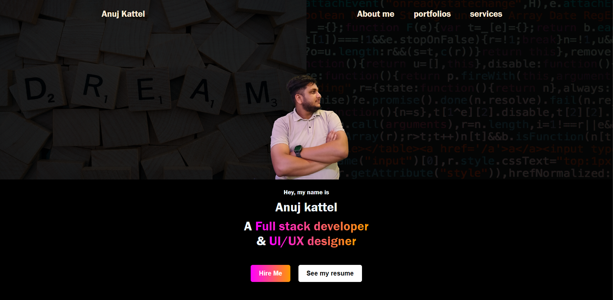

# Portfolio Website

This portfolio website showcases **Anuj Kattel**, a Full-Stack Developer and UI/UX Designer, highlighting their skills, projects, and services. Built using **HTML, CSS, and JavaScript**, this site has a responsive layout, modern design elements, and is optimized for a great user experience.



## Features

- **Responsive Design**: Works well on desktop and mobile devices.
- **Smooth Navigation**: Includes a fixed navigation bar for easy access to different sections.
- **Skills Showcase**: Displays Anuj's skills with icon visuals for each technology.
- **Services Section**: Lists available services with pricing for each.
- **Social Media Links**: Provides links to social media profiles to connect with Anuj.
- **Customizable and Scalable**: Built with HTML, CSS, and JavaScript, allowing easy customization.

## Sections Overview

1. **Header**: 
   - Contains the site’s logo, navigation links, and a sticky menu button for mobile view.
   
2. **Introduction**:
   - An introductory section featuring a background image overlay, Anuj’s title, and brief description.

3. **Skills**:
   - Lists skills with icons for HTML, CSS, JavaScript, Bootstrap, MongoDB, Express.js, React, and Node.js.

4. **About Me**:
   - Highlights Anuj's background and passion for development and design.

5. **Services**:
   - Provides three main services: UI/UX Design, Front-End Development, and Full-Stack Development, with detailed service lists and pricing.

6. **Social Media**:
   - Icons for Facebook, Instagram, and YouTube to connect with Anuj.

7. **Footer**:
   - Credits Anuj Kattel as the creator.

## Installation

1. Clone this repository:
   ```bash
   git clone https://github.com/anujkattel/portfolio.git
   ```
2. Open index.html in your browser to view the website locally.

## Technologies Used

- **HTML**: For the website structure.
- **CSS**: For styling, layout, and responsiveness.
- **JavaScript**: For interactive elements and enhanced user experience.
- **Font Awesome**: For icons.

## License

This project is open-source and available under the [MIT License](LICENSE).
